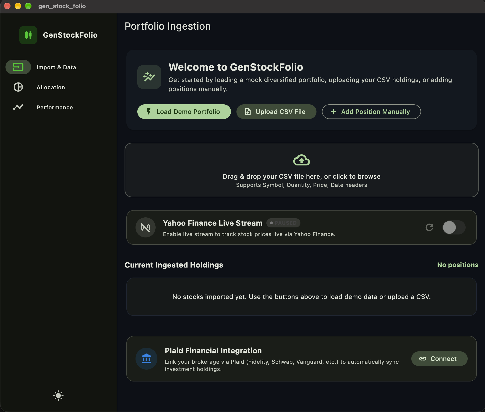

# GenStockFolio — Cross-Platform Stock Portfolio Analyzer

**GenStockFolio** is a stock portfolio analyzer built with **Flutter 3.41.6 (Dart 3.11.4)** for **macOS Desktop**, **Web (Chrome)**, and **iOS Mobile**. Developed under strict **Spec-Driven Development (SDD)** with 100% gated specification approvals and automated unit/widget test verification.

---

## 🏛️ Monorepo Architecture

The repository is structured as a modular Flutter monorepo:

```
week1-project-stock-analyzer/
├── apps/
│   └── gen_stock_folio/               # Host application (macOS, Web, iOS)
│       ├── lib/
│       │   ├── core/
│       │   │   ├── router/            # GoRouter StatefulShellRoute (Adaptive NavigationRail/NavigationBar)
│       │   │   └── theme/             # Material 3 Dark/Light Theme (Fintech Emerald #00C805)
│       │   ├── l10n/                  # App-level localization delegates
│       │   └── app.dart               # MaterialApp.router configuration
│       └── test/                      # Multi-tab integration and smoke widget tests
├── packages/
│   ├── portfolio_feature/             # Tab 1: Data Ingest & Management
│   │   ├── lib/domain/                # HoldingPosition, PortfolioSummary, Result<T>
│   │   ├── lib/data/                  # CsvParserService, LocalPortfolioStorage, MockBrokerageRepository
│   │   └── lib/presentation/          # PortfolioViewModel, CsvPreviewDialog, ManualPositionDialog
│   ├── allocation_feature/            # Tab 2: Allocation & Breakdown
│   │   ├── lib/domain/                # SectorAllocation domain model
│   │   └── lib/presentation/          # AllocationPieChart (radial explosion), HoldingsBreakdownTable, PositionDetailSheet
│   └── analytics_feature/             # Tab 3: Performance & Risk Engine
│       ├── lib/domain/                # HistoricalDataPoint, RiskMetrics
│       └── lib/presentation/          # PerformanceSummaryCards, EquityCurveChart (FL Chart), RiskIndicatorsGrid
└── specs/                             # 7 Approved SDD Specifications
    ├── 01_product_scope.md
    ├── 02_user_journeys_and_features.md
    ├── 03_architecture_and_monorepo.md
    ├── 04_design_system_and_responsive.md
    ├── 05_api_and_data_contracts.md
    ├── 06_testing_strategy.md
    └── 07_implementation_plan.md
```

---

## ✨ Key Features

1. **Tab 1: Portfolio Ingestion (`portfolio_feature`)**
   - **1-Click Demo Portfolio**: Instantly populates 6 diversified positions (AAPL, MSFT, NVDA, GOOGL, AMZN, TSLA) across Technology, Communication Services, and Consumer Cyclical.
   - **CSV Ingestion Engine**: Robust parser supporting Schwab, Fidelity, and standard CSV exports with newline normalization (`\r\n` / `\n`) and preview confirmation dialog.
   - **Manual Position Editor**: Add or edit positions with automated validation and ticker capitalization.
   - **Plaid Financial Integration**: Connects via official [Plaid Investments API](https://plaid.com/docs/investments/) (`/investments/holdings/get`) supporting multi-brokerage aggregation (Fidelity, Schwab, Vanguard, etc.), cross-referencing securities and holdings with full Sandbox and Live credential modes.
   - **Local Persistence**: Automatically caches holdings in local storage across app sessions.

2. **Tab 2: Asset Allocation (`allocation_feature`)**
   - **Interactive Pie Chart**: Animated slice selection with radial explosion (`radius: 110` with badge callouts).
   - **Bi-Directional Cross-Filtering**: Selecting a pie chart slice filters the holdings table; clearing filter restores all positions.
   - **Sortable Holdings Breakdown**: Sort by Market Value, Profit / Gain (\$), Return Rate (%), or Ticker Symbol with ascending/descending toggling.
   - **Position Detail Sheet**: Deep-dive bottom sheet displaying 30-day sparkline trend and position statistics.

3. **Tab 3: Performance & Lifetime Analytics (`analytics_feature`)**
   - **Lifetime Summary Cards**: Invested capital, Current valuation, and Net P&L (\$, %).
   - **Equity Curve vs. S&P 500**: Dual-line chart comparing user portfolio growth against the S&P 500 baseline across `1M`, `3M`, `6M`, `1Y`, and `ALL` timeframes.
   - **Risk Indicators Grid**: Computes Portfolio Beta, Sharpe Ratio, and Diversification Score (0–100) with color-coded badges and responsive auto-wrapping.

4. **Adaptive Presentation Layer**
   - **Desktop / Web (≥ 600dp)**: Collapsible `NavigationRail` with persistent sidebar branding, theme mode toggle, and `maxWidth: 1200` centered content bounds.
   - **Mobile (< 600dp)**: Material 3 `NavigationBar` with haptic-friendly tap targets and bottom modal sheets.
   - **Localization**: Zero hardcoded UI strings; fully localized with `.arb` and `flutter_localizations`.

---

## 🚀 Running the App

### macOS Desktop
```bash
cd apps/gen_stock_folio
flutter run -d macos
```

### Web (Chrome)
```bash
cd apps/gen_stock_folio
flutter run -d chrome
```

### iOS Simulator
```bash
cd apps/gen_stock_folio
flutter run -d "iPhone 16 Pro"
```

---

## 🧪 Testing & Verification

Run the automated test suites across all packages:

```bash
# Host App Widget Tests
(cd apps/gen_stock_folio && flutter test)

# Portfolio Feature Unit & ViewModel Tests
(cd packages/portfolio_feature && flutter test)

# Allocation Feature ViewModel & Cross-Filtering Tests
(cd packages/allocation_feature && flutter test)

# Analytics Feature Math & Trajectory Tests
(cd packages/analytics_feature && flutter test)
```

### Static Analysis
```bash
(cd apps/gen_stock_folio && flutter analyze)
(cd packages/portfolio_feature && flutter analyze)
(cd packages/allocation_feature && flutter analyze)
(cd packages/analytics_feature && flutter analyze)
```
All packages pass with **0 issues found**.

## Screen shots


### Recording
